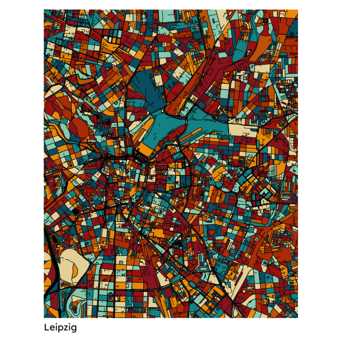
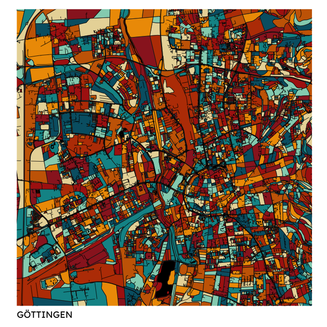

<!-- README.md is generated from README.Rmd. Please edit that file -->

# kARTe

<!-- badges: start -->
<!-- badges: end -->

Create ART from geodata

## Installation

You can install the development version of kARTe from
[GitHub](https://github.com/) with:

``` r
# install.packages("devtools")
devtools::install_github("nldoc/kARTe")
```

## Example

``` r
## Load package
library(kARTe)
```

A kARTe can be created from a location provided as string:

``` r
## Define edge buffer
## These edges will reduce the part of the bbox that is shown in the final picture
## This ensures that cut-off roads and other artifacts are removed from the final frame
edge_buffer = c(0.12, 0.08)

## Create a kARTe using a custom bounding box
create_kARTe(location = "Leipzig",
             edge_buffer = edge_buffer,
             color_palette = "original",
             color_water = "black",
             roads_linewidth = 0.3,
             river_linewidth = 0.3,
             label = "Leipzig",
             gfont_name = "Lexend",
             gfont_size = 14,
             export = FALSE)
#> Load admin_level ...
#> Loading required namespace: sf
#> Load natural ...
#> Load waterway ...
#> Load highway ...
#> Linking to GEOS 3.11.0, GDAL 3.5.3, PROJ 9.1.0; sf_use_s2() is TRUE
```



Alternatively, a custom bounding box can be used to create the kARTe:

``` r
## Define bounding box parameters
xmin=9.871
xmax=9.971
ymin=51.51
ymax=51.57
bbox = c(xmin, xmax, ymin, ymax)

## Define edge buffer
## These edges will reduce the part of the bbox that is shown in the final picture
## This ensures that cut-off roads and other artifacts are removed from the final frame
edge_buffer = c(0.01, 0.005)

## Create a kARTe using a custom bounding box
create_kARTe(bbox = bbox,
             edge_buffer = edge_buffer,
             color_palette = "original",
             color_water = "black",
             roads_linewidth = 0.3,
             river_linewidth = 0.3,
             label = "GÖTTINGEN",
             gfont_name = "Lexend",
             gfont_size = 14,
             export = FALSE)
#> Load admin_level ...
#> Load natural ...
#> Load waterway ...
#> Load highway ...
```


